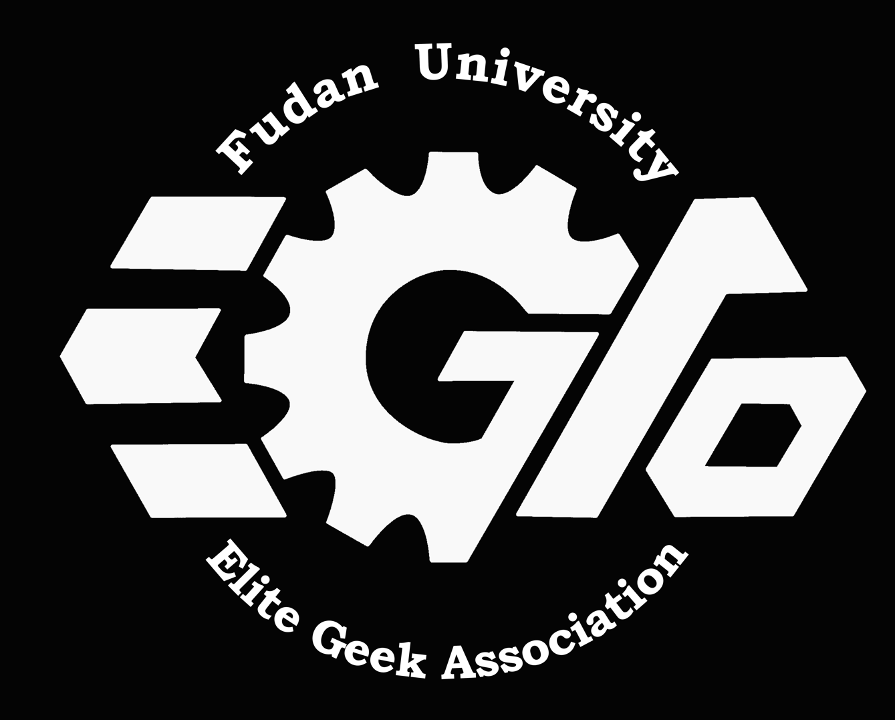

# 【2025-复旦大学-星云EGA】 云台Yaw轴滑模控制器开源

 

## 1.为什么选择滑模控制器？
### 1.1.初衷
​	2025年作为复旦大学首次参与RoboMaster机甲大师赛的元年，我们面临着极具挑战性的技术攻坚周期：自10月正式启动开发工作起，距离联盟赛上海站仅剩不足六个月，此时我们还没有一台成熟的机器人。为在有限时间内构建具备实战能力的步兵机器人电控系统，我们亟需攻克两大核心技术难点——高响应云台操控手感的实现与稳定可靠的自瞄跟踪系统开发。 在此背景下，设计一套参数调试成本低、抗干扰能力优异且控制精度达标的智能控制算法，成为缩短开发周期、提升技术迭代效率的核心突破口。在2025年RoboMaster联盟赛上海站中，**星云EGA战队的步兵、英雄、哨兵大小Yaw均使用滑模控制器**，在调试过程中几乎没有改过参数，实现对遥控器信号跟踪误差<4°,稳态误差<0.1°，最终取得步兵对抗赛冠军，3v3对抗赛8强的成绩。  

下面总结滑模控制器的优势：  
**(1)调参便捷**：整套算法只需调3个关键参数，每个参数微调范围小，新手也能半小时上手，比传统方法省时省力；   
**(2)手感较好**：稳态误差和跟踪误差均较小，手感极好，延迟感小；  
**(3)公式简洁易用**：与前馈反馈控制相比，本滑模控制器公式极其简洁，不需要对信号进行多次处理，也不需要处理积分效应等普通pid存在的问题；  
**(4)通用性强**：实验室三种不同结构的机器人用同一组参数都能流畅运行，换机不重调。

### 1.2.效果
星云EGA步兵机器人如下：以大疆robomaster开发板C型板载陀螺仪为反馈，云台电机为GM6020

控制效果见附件视频1。

## 2.滑模控制器设计过程
参考附件中“滑模控制器设计.pdf”

## 3.使用说明
### 3.1.在你的主逻辑中：
### （1）初始化SMC类
`SMC YawSMC(20, 120, 0, 0.001, 25000, 0.8, 0.5); `

****
### 3.2.在你的主循环中：
### （1）设置滑模控制器目标值
`YawSMC.ref = 你的角度目标;`
### （2）调用SMC计算器
`YawSMC.SMC_Tick(angle_now,angle_vel);`  
注意角度为°，角速度为°/s
### （3）最后，输出电流
`YourCanSendFunction(YawSMC.u);`
### tips:可能会存在正反馈的问题，建议检查反馈符号和输出电流的符号
## 4.其他注意事项以及未来改进方向：
### 4.1.为什么不用在pitch上面？

​	pitch电机的电机模型与yaw是不一致的。在yaw电机模型中，角速度微分即为电机电流*系数，而pitch由于重力矩的原因，在模型中角速度微分后不一定为电机输出转矩，而是需要对重力矩进行补偿后才为电机输出转矩，而实际情况下，重力矩不好估计。

### 4.2.对于前馈部分的处理:

​	在代码中涉及目标值的两次微分和一次微分，在离散系统中变成差分，这种微分方式会带来很大抖动（因为差分会放大噪声），所以在代码中差分后单位并没有严格统一（统一单位会乘以一个系数）。

### 4.3.目前存在的缺陷：
**(1)对比较抖动的目标值敏感**  

在调自瞄时，自瞄传值是很抖的，滑模对于这种抖动目标值比较敏感，可以套一层低通滤波消抖。

**(2)小陀螺时带来的扰动对精度有微小影响**

小陀螺带来的电机速度变化视作外部扰动并没有考虑在模型之中，因此会对控制精度产生影响。经测试，小陀螺时可能会带来微小的稳态误差。

### 4.4.其他建议

后续还可以改为非奇异快速终端滑模控制，保证响应速度更快，超调更小。

## 5.参考文献：
非线性系统（十三）滑模控制解析 - Chenglin Li的文章 - 知乎
https://zhuanlan.zhihu.com/p/138860110  
非线性系统（十四）滑模控制器设计流程 - Chenglin Li的文章 - 知乎
https://zhuanlan.zhihu.com/p/139066859  
通俗理解滑模变结构控制(1) - 超级菜狗的文章 - CSDN
https://blog.csdn.net/qq_36903625/article/details/111650102?spm=1001.2014.3001.5502  
滑模控制的一种简单理解 - 半年这么快过去了的文章 - 知乎 
https://www.zhihu.com/tardis/zm/art/463230163?source_id=1005
****
开源者： 复旦大学-梅峻炜；  
特别鸣谢：复旦大学-星云EGA战队：李欣睿，任轩呈；四川大学-火锅战队：杨世亮，洪锦忠；  
同时感谢复旦大学星云EGA战队黄奇伟老师、黎林学长、张安队长以及电控组包毅、谢家伟等人的支持，真诚祝福星云EGA战队越来越好！